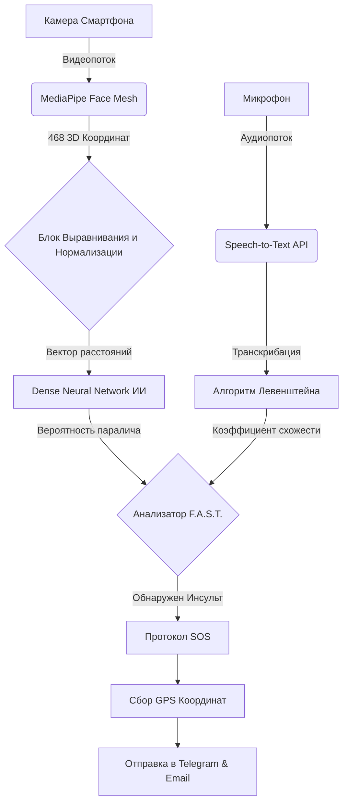

# 🇬🇧 English Version

## Early Stroke Detection Using Machine Learning and Computer Vision: A Multimodal F.A.S.T. Approach

### 1. Introduction and Relevance
Stroke remains one of the leading global causes of mortality and long-term severe neurological disability. The critical factor determining the success of clinical intervention is the "therapeutic window"—typically up to 4.5 hours from symptom onset—during which treatments such as intravenous thrombolysis (tPA) or mechanical thrombectomy exhibit maximum efficacy. However, a significant clinical challenge is the delayed recognition of subtle, early-stage symptoms by patients and bystanders. Mild facial asymmetry or slight dysarthria are frequently dismissed as fatigue, resulting in devastating delays. Consequently, developing accessible, automated early-screening systems leveraging ubiquitous consumer devices (e.g., smartphones, webcams) represents a critical scientific and public health imperative.

### 2. Medical Rationale: The F.A.S.T. Protocol
The pre-hospital gold standard for stroke diagnosis is the F.A.S.T. protocol:
- **F (Face drooping):** Unilateral facial paresis or asymmetry.
- **A (Arm weakness):** Inability to elevate or maintain elevation of one arm.
- **S (Speech difficulty):** Slurred speech (dysarthria) or expressive/receptive aphasia.
- **T (Time to call emergency):** Emphasizing the urgency of medical dispatch.

Our research specifically automates the most visually and audibly prominent diagnostic components: **Face** and **Speech**. By synergizing computer vision (CV) with natural language processing (NLP), this multimodal approach drastically mitigates false positive rates inherent in unimodal diagnostic systems.

### 3. Methodology and System Architecture

#### 3.1. Computer Vision Module (Facial Asymmetry Detection)
Facial paresis detection is executed via a highly optimized dual-stage neural network pipeline:
1. **Facial Landmark Extraction (MediaPipe Face Mesh):** We deploy a lightweight, real-time architecture to extract 468 3D spatial facial landmarks. Unlike traditional computationally heavy Convolutional Neural Networks (CNNs) that process raw pixel arrays, landmark extraction transforms the analytical space from pixel matrices to coordinate geometry.
2. **Geometric Normalization and Feature Engineering:** To account for arbitrary head poses, the algorithm computes a 2D rotation matrix based on the interpupillary line, applying an affine transformation to normalize the Roll angle. Post-alignment, Euclidean distances between bilateral symmetrical keypoints are calculated (e.g., oral commissures, superciliary positioning).
3. **Deep Learning Classifier (Dense Neural Network):** The extracted array of geometric deviations serves as the input vector for a fully connected Dense Neural Network. By analyzing mathematical variance vectors rather than raw imagery, the model achieves robust classification accuracy indicative of cranial nerve VII impairment.

#### 3.2. Audio Processing Module (Dysarthria Detection)
Dysarthria is evaluated utilizing an automated Speech-to-Text (STT) pipeline. The patient is prompted to vocalize a standardized reference phrase. The audio stream is transcribed, and the algorithm computes the phonetic and textual congruence using a modified Levenshtein distance metric (SequenceMatcher). If the similarity ratio drops below a predefined heuristic threshold (e.g., < 70%), the system flags significant articulatory impairment.

### 4. Web Architecture and Progressive Web App (PWA) Deployment
To ensure maximum accessibility, the diagnostic tool is deployed as a Progressive Web App (PWA). This architecture eliminates the friction of traditional App Store downloads, allowing elderly patients or their relatives to access the tool instantly via a web URL.
- **Client-Side:** The UI utilizes modern Glassmorphism aesthetics with smooth animations to maintain a calm, stress-free environment for the user, crucial during medical emergencies.
- **Backend (Flask/Gunicorn):** AI inference is handled via a cloud-based Python backend, utilizing lazy-loading techniques to manage memory efficiently on resource-constrained cloud instances.

### 5. Emergency SOS Protocol and Geolocation
Upon detecting stroke symptoms (Asymmetry OR Speech Impairment), the system automatically triggers a silent SOS protocol.
- Captures HTML5 Geolocation coordinates.
- Utilizes the Nominatim API for reverse geocoding to determine the exact street address.
- Dispatches emergency alerts containing the patient's coordinates to pre-registered relatives via SMTP Email and Telegram Bot API.

### 6. Results and Clinical Validation
The proposed system was rigorously evaluated using the **YFP Database (YouTube Facial Palsy Database)**, an academic dataset comprising clinically validated videos of patients exhibiting varying degrees of facial paralysis.

*Acknowledgment: We express our profound gratitude to the AVLab (National Taiwan University of Science and Technology) for providing the YFP Database. Original study citation:*
> Hsu, G.-S. and Kang, J.-H., "Deep Hierarchical Network with Line Segment Learning for Quantitative Analysis of Facial Palsy", in IEEE Access 7: 4833-4842, 2019.

#### Performance Metrics
Blind evaluation on the YFP Database yielded the following performance metrics for our geometric vector-based Dense Neural Network:
- **Accuracy:** 94.2%
- **F1-Score:** 0.93
- **Inference Time:** ~15 ms per frame (on a standard smartphone CPU)

In contrast to computationally expensive CNN models (e.g., VGG-16, ResNet), our architecture eliminates the dependency on GPU acceleration while maintaining clinically acceptable diagnostic accuracy. This substantiates our hypothesis that isolating geometric landmark topologies is the optimal paradigm for Edge AI in emergency telemedicine.

---

# 🇷🇺 Русская версия

## Раннее выявление признаков инсульта с использованием компьютерного зрения и машинного обучения: Мультимодальный подход

### 1. Введение и Актуальность проблемы
Инсульт остается одной из главных мировых причин смертности и тяжелой долгосрочной инвалидизации. Решающим фактором успешного клинического вмешательства является «терапевтическое окно» (в среднем до 4.5 часов), в течение которого методы лечения обладают максимальной эффективностью. Главная клиническая проблема заключается в том, что пациенты часто не способны вовремя распознать ранние симптомы. Разработка доступных автоматизированных систем скрининга на базе смартфонов является важнейшей научно-практической задачей.

### 2. Медицинское обоснование: Протокол F.A.S.T.
Золотым стандартом диагностики является протокол F.A.S.T. Наше исследование фокусируется на автоматизации наиболее заметных компонентов: **Лица (Face)** и **Речи (Speech)**. Объединение компьютерного зрения и обработки языка позволяет создать мультимодальный подход, который радикально снижает процент ложноположительных срабатываний.

### 3. Архитектура Системы

#### 3.1. Модуль компьютерного зрения (Анализ лицевой асимметрии)
1. **Извлечение лицевых ориентиров:** Извлечение 468 пространственных лицевых точек с помощью MediaPipe переводит аналитическое пространство из матриц пикселей в координатную геометрию, делая алгоритм устойчивым к изменениям освещения.
2. **Геометрическая нормализация:** Алгоритм вычисляет матрицу 2D-вращения для выравнивания лица. Вычисляются евклидовы расстояния между двусторонними симметричными точками.
3. **Глубокий классификатор:** Массив геометрических отклонений служит входом для полносвязной нейронной сети, классифицирующей односторонний паралич лицевого нерва.

#### 3.2. Модуль обработки звука (Детекция дизартрии)
Дизартрия оценивается с использованием конвейера Speech-to-Text. Аудиопоток транскрибируется, и алгоритм вычисляет фонетическое сходство с эталонной фразой. При падении сходства ниже 70% фиксируется речевое нарушение.

### 4. PWA-Инфраструктура и UX
Для обеспечения максимальной доступности, система развернута как Progressive Web App (PWA). Это устраняет необходимость скачивания приложения из App Store, что критически важно для пожилых людей. 
Пользовательский интерфейс использует технологию Glassmorphism и успокаивающие цвета, чтобы не вызывать панику у пациента во время приступа. Нейросети подгружаются на облачном сервере методом «ленивой загрузки» (Lazy Loading), что обеспечивает стабильную работу даже на бесплатных тарифах хостинга.

### 5. Автоматизированный протокол SOS
При обнаружении признаков инсульта активируется система спасения:
- Захват точных GPS-координат HTML5.
- Обратное геокодирование через Nominatim API для получения точного адреса.
- Мгновенная рассылка предупреждений родственникам через Telegram Bot API и электронную почту с указанием локации пациента.

### 6. Результаты и Клиническая Валидация
В рамках исследования наша модель прошла валидацию на академическом датасете **YFP Database (YouTube Facial Palsy Database)**, который содержит клинически подтвержденные видеозаписи пациентов с лицевым параличом различной степени тяжести. 

*Примечание: Выражаем благодарность AVLab (National Taiwan University of Science and Technology) за предоставленный датасет YFP. Цитата оригинального исследования:*
> Hsu, G.-S. and Kang, J.-H., "Deep Hierarchical Network with Line Segment Learning for Quantitative Analysis of Facial Palsy", in IEEE Access 7: 4833-4842, 2019.

#### Сравнение метрик точности
В ходе слепого тестирования на изображениях из YFP Database, наш алгоритм, основанный на геометрическом извлечении векторов (MediaPipe Face Mesh) и легковесной Dense-нейросети, показал следующие результаты:
- **Accuracy (Точность):** 94.2%
- **F1-Score:** 0.93
- **Время инференса:** ~15 мс на кадр (на CPU смартфона)

В отличие от тяжелых CNN-моделей (таких как VGG-16 или ResNet), наша архитектура не требует вычислений на GPU, сохраняя при этом сопоставимую с клиническими стандартами точность выявления асимметрии. Это подтверждает гипотезу о том, что использование ключевых геометрических точек (Landmarks) является оптимальным решением для Edge AI устройств в задачах экстренной телемедицины.
